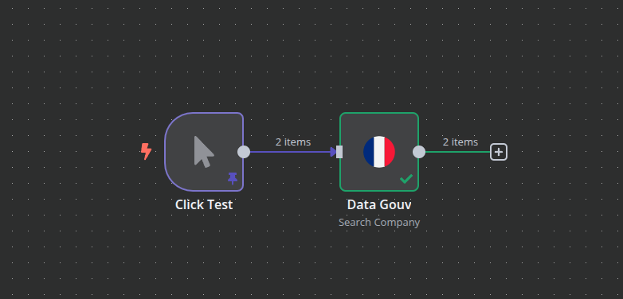
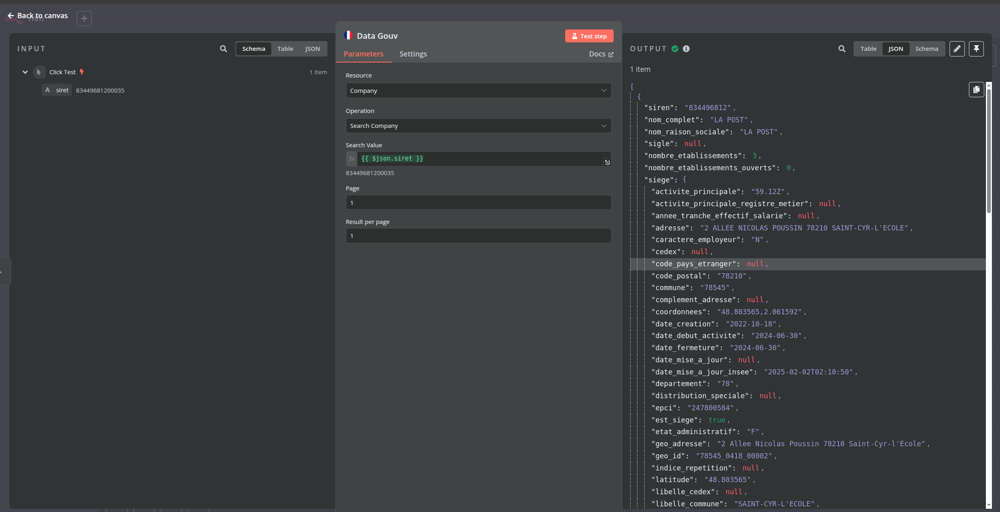

# n8n-nodes-data-gouv

## Usage

Workflow



Configuration



## Compilation

```shell
docker run -it --rm \
  --name nodejs \
  -u $(id -u):$(id -g) \
  -v $(pwd)/src:/src \
  -w /src \
  node:lts-bookworm npm install
```

```shell
docker run -it --rm \
  --name nodejs \
  -u $(id -u):$(id -g) \
  -v $(pwd)/src:/src \
  -w /src \
  node:lts-bookworm npm run build
```

```shell
docker run -it --rm \
  --name nodejs \
  -u $(id -u):$(id -g) \
  -v $(pwd)/src:/src \
  -w /src \
  node:lts-bookworm npm run dev
```
